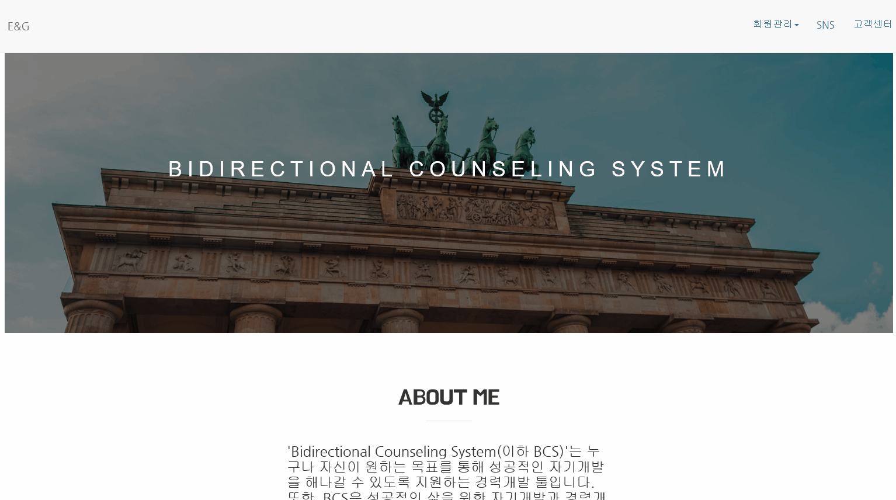

# Bidirectional-Counseling-System

## 목차

1. [프로젝트 소개](##1.프로젝트-소개)

2. [개발 도구 및 환경](##2.개발-도구-및-환경)

3. [기능](##3.기능)

## 1.프로젝트 소개

**Bidirectional-Counseling-System** 프로젝트는 양방향 멘토멘티 매칭 웹 어플리케이션입니다. 자신의 멘토를 찾으면서 다른 회원의 멘토가 될 수 있습니다. 자신의 스펙과 경력을 저장하면 이 정보를 다른 회원의 멘토 매칭에 사용합니다. 또한 자신의 목표를 설정하여 알맞는 스펙과 경력을 보유하고 있는 회원을 멘토로 추천해줍니다.

## 2.개발 도구 및 환경

- Java EE
- Servlet
- JSP
- JavaScript
- Jquery
- Jstl
- Apache Tomcat
- Bootstrap
- MySQL
- Java8 (zulu open jdk)

## 3.기능

- 회원가입 
  </img>
- 로그인/로그아웃 
  </img>
- 마이페이지 
  </img>
- 목표 설정 
  </img>
- 멘토 매칭 
  </img>
